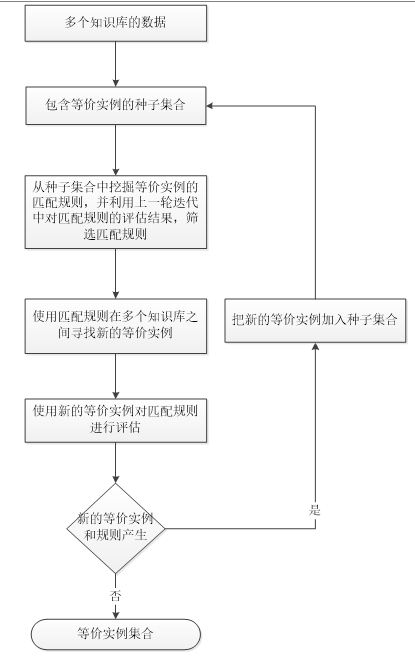
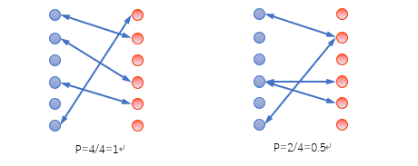

# entity matching
从结构一样，内容不同的两个知识库中寻找等价实体，比如百度百科知识库与互动百科知识库。

知识库以三元组表示，head, relation, tail分别对应实体名，属性，属性值。三元组示例
```text
巴雷特;;;;;;中文名;;;;;;巴雷特M82A1
巴雷特;;;;;;外文名;;;;;;BarrettM82A1
巴雷特;;;;;;生产公司;;;;;;巴雷特火器制造公司
巴雷特;;;;;;国家;;;;;;美国
巴雷特;;;;;;类别;;;;;;狙击步枪
巴雷特;;;;;;口径;;;;;;12.7
巴雷特;;;;;;研发日期;;;;;;1980年
巴雷特;;;;;;生产日期;;;;;;1982年
巴雷特;;;;;;设计师;;;;;;朗尼·巴雷特
```

等价实体示例（hudongbaike<->baidubaike）
```text
巴雷特;;;;;;m82a1狙击步枪
```

## 配置文件说明

```text
第1行 结果生成文件夹
第2行 源0三元组文件
第3行 源1三元组文件
第4行 candidates阈值，取值0到1 (e.g. 0.97)
第5行 关联规则最小支持度 (e.g. 5)
第6行 关联规则最小置信度，取值0到1 (e.g. 0.1)
第7行 关联规则divergence Threshold，取值0到1 (e.g. 0.93)
第8行 是否进行剥离(实体 e.g. <吴之章>，属性值)括号的操作，取值0或1 (e.g. 0)
第9行 是否执行种子挖掘程序，取值0或1 (e.g. 1)
第10行 种子文件路径，可以为空""
第11行 同义词文件路径，可以为空""，也可以提供多个文件，文件路径用空格间隔
```

## 快捷使用方法

### 直接使用
- 安装java
- 运行`python main.py`，该文件中直接调用jar包，可以直接使用算法
- 生成的结果就存储在当前路径的workspace中，可以在配置文件中设置
- 
### 使用自己的数据集
- 安装java
- 首先把两个知识库数据处理成类似 `data/xiaomi/xiaomi.nt`的三元组格式，每个实体、关系、属性的文本内不能有换行符，空格及制表符全部换成下划线。
- 仿照`data/xm_hw_sames.txt`文件，把两个知识库之间人为标注好的等价实体名称对写入文件。该文件用于种子文件的生成以及算法匹配后进行指标评价
- 计算知识库中需要等价匹配的实体出度和入度，处理成类似`data/xiaomi/xiaomi_in_out.json`文件的格式
- 仿照`configs/xiaomi_huawei_configure`文件，在`configs`文件夹里添加两个知识库配置
- 修改文件路径，运行`python main.py`
 
## 基础使用方法

### 运行说明

```text
java -Dfile.encoding=utf-8 -Xmx2048m -jar data/entity_matching.jar configs/hudongbaike_baidubaike_config.txt
```

**⚠️**

1. 数据应该充足，使得能够支持规则的支持度，才能进一步挖掘新等价实体
2. 程序比较耗费内存，且复杂度较大，当数据量非常大的时候，需要调大**关联规则支持度**和**内存使用**, (e.g. 百度百科全部数据，关联规则支持度要大于800，内存要大于100G，运行时间大约1天。)
3. 进行实体匹配的两个数据源应该是同构的
4. 为了保证找到的等价实体的准确性，一般candidates阈值设的比较高


### 代码结构细节

```text
algorithm
    |AssociationRuleMiner--挖掘等价属性对；
                            包含一个属性索引事务的TreeMap<Property, List<Integer>> plist,
                            每一个事务可以通过一个整数在TransactionTable中访问；
                            等价属性作为关联规则只有两个元素，所以只找到大小为2的频繁集就行了，一左一右
    |Main--读取配置文件，运行规则挖掘过程，在挖掘过程中获得等价实例
    |MatchingRuleMiner--
                        MineIFPSs()
                        MineIFPSDirectly()
                        GetCorrespondences()
                        getPVMap()--获取一个s的{属性:值集合}
                        mine()--迭代执行，并保存candidates，seeds，matches
    |PVSetProcessor--PVPairSetsIsEqual()判断{属性：值集合}是否等价（其实就是比较两个实体的infobox了）
concurrent
    |CandidatesReader--读取保存的candidates(CorrespondenceSet)文件
    |MatchSetReader--读取并返回MatchSet，一个Match对象的第一个实体来自源0，第二个实体来自源1
    |TripleSetReader--读取三元组文件，返回Map<Instance, TripleSet>
model
    collections
        |CorrespondenceSet--TreeSet<Correspondence>；能够选择置信度大于设定阈值的 Correspondences；
                            能够通过参数(Instance e1, Instance e2, conf)向 CorrespondenceSet中添加 Correspondence，
                            并对已存在的 Correspondence进行置信度融合；
                            可以把其他 CorrespondenceSet(iniCorrespondenceSet)合并进来
        |IFPSSet--存放IFPS规则的集合    TreeSet<PPairSet>
        |MatchSet--存放匹配的集合   Set<Match>
        |PPairSet--IFPS规则，包含等价属性对集合TreeSet<PPair>，CG图Map<EPSKey, Integer>，记录了每个连通分量大小；
                    为CG图加边；计算divergence；判断一个PPairSet的等价属性集是否是该PPairSet的等价属性集的子集；
                    能够判断自己是否需要加入到IFPSSet中
        |PropertySet--
        |RuleMatcher--candidates为字典{属性-值：实体集合}或者{PVPair2:Set<Instance>}，add为索引的建立；
                        match2把含有相同属性-值的实体作为匹配到的等价实例返回
        |Suite--
        |TransactionTable--事务表，下标索引Transaction（匹配的属性）和Match
        |TripleSet--LinkedList<Triple>，能够获取特定s的所有三元组，以及特定s与p的o集合
    element
        |Correspondence--包含Match和其置信度
        |EPSKey--CG图的连通分量标识
        |Instance--实例，包含源和字面值（字符串）的索引
        |Mapping--索引字符串，利用并查集构建同义词集合（同义词集合中字符串同义，索引相同）
        |Match--包含两个Instance
        |Pair--(first, second)
        |PPair--等价属性对，Property p1, p2; int cnt;
        |Property--属性，包含源和属性字符串的索引
        |PVPair--属性值对(old)
        |PVPair2--属性值对，只用在RuleMatcher中，Property p，Integer v：值的索引
        |Transaction--每个事务包含一个匹配中两个实例的所有属性，没有值
        |Triple--三元组<Instance:s, Property:p, Instance:o>
test
    |Test--小例程
    |testes--小例程
util
    |Operator--biAnd()求升序列表l1和l2的交集
    |SubSetGenerator--
    |Util--compareSet(set1, set2)字典序比较集合大小，getLabelname()从url中抽取实体名称
```


### 算法说明

多源知识匹配技术，在不同数据源构建的知识库之间寻找等价实例。利用EM算法设计一种半监督学习算法，迭代的执行从现有等价实例中提炼匹配规则，和用提炼的匹配规则来发现新的等价实例这两个过程。这个匹配规则是利用算法自动的提取，这里的匹配规则就是等价属性构成的集合。

首先要解决的问题是寻找等价属性，因为在两个数据源之间。对于属性的描述，不一定一致。（比如：主要演员<->主演；影片片长<->片长）

如果两个实例标题不等，但是对于等价属性集合中的属性值都相等，那么这两个实例应该是可以判断为等价的。

这里面需要考虑的就是：如何自动的寻找合适的等价属性构建有用的匹配规则。



#### 最大化步骤(max-step)

通过已存在的等价实例作为种子集合，挖掘匹配规则（这里的匹配规则，就是等价属性的组合）

```text
如果baidu:x和hudong:x是一对候选等价实例，当且仅当：
   valueOf(baidu:标签)=valueOf(hudong:中文学名) 
   且 valueOf(baidu:拉丁学名)=valueOf(hudong:二名法) 
   且 valueOf(baidu:纲)=valueOf(hudong:纲)。
```
这里面的valueOf直接比较字符串（考虑了同义词，利用重定向文件，并查集算法）

**例**

等价实体：（zhwiki:运-20<->hudongbaike：鲲鹏）

等价属性：

| | zhwiki | hudongbaike |
| --- | --- | --- |
| 1 | 首飞时间 | 首次试飞时间 |
| 2 | 类型 | 类型 |
| 3 | 设计师 | 总设计师 |
| 4 | 型号 | 型号 |

**规则样例**

| source0 | source1 |
| --- | --- |
| 导演 | 导演 |
| 主要演员 | 主演 |
| 影片片长 | 片长 |
| 首播时间 | 开播时间 |

（一对差的例子，需要被似然函数过滤掉）

| source0 | source1 |
| --- | --- |
| 国籍 | 国籍 |
| 性别 | 性别 |

（一对比较有用的规则（等价属性））

| source0 | source1 |
| --- | --- |
| 出生地 | 出生地 |
| 出生日期 | 生日 |
| 去世日期 | 逝世日期 |


---

**难点**

##### 1. 等价属性如何得到

首先从等价实例中挖掘共现属性对（通过关联规则挖掘进行频繁集挖掘），比如：

```text
中文名 中文名 0
中文名 出生地 0
中文名 出生日期 0
中文名 逝世日期 0
中文名 职业 0
中文名 毕业院校 0
中文名 信仰 0
中文名 主要成就 0
出生地 中文名 0
出生地 出生地 0
出生地 出生日期 0
出生地 逝世日期 0
出生地 职业 0
出生地 毕业院校 0
出生地 信仰 0
```
共现属性对要满足一定的置信度和支持度（即有多少对等价实体中出现了这对属性）


##### 2. 规则如何（翻滚）得到

共现属性对会直接用来组成规则，等价属性对集合 就是 规则。
这些属性对一开始只有一条，会在两个知识图谱中做属性值的等价测试，找到属性对对应的属性值相等的情况作为该规则的支持度
比如：国籍 国籍（对应属性值相同的实例对就很多）
但：出生地 出生日期（对应属性值相同的实例对就没有，这样的属性对会被直接过滤掉，不满足规则支持度）

经过一轮之后，对这些剩下的属性进行两两组合，两三组合，一直翻滚，同时保证规则支持度。

所以，规则会从两方面筛选
1. 规则支持度
2. 规则置信度（下面似然函数）

然后筛选掉上一轮迭代中评估效果不好的匹配规则。

EM中的似然函数定义为：等价实例图连通分量/边，（假设同一知识库不包含等价实例，则每个实例应该在另一个知识库中至多找到一个等价实例）




#### 期望步骤(expect-step)

利用这些匹配规则在多个知识库之间寻找新的等价实例，加入种子集合。

**算法描述**

```text
得到等价实例（字符串匹配），两个数据源a, b
do:
   从现有等价实例中，使用关联规则挖掘，挖掘频繁集大小为2的属性对。
   这里的频繁集中的属性来自两个数据源。
   从seeds+candidates构建事务表，并挖掘共现属性
   tran1: pa1, pa2, ..., pb1, pb2
   tran2: pa1, pa2, ..., pb1, pb2
   转化
   pa1: tran1, tran2, ...
   pa2: tran1, tran2, ...
   pa1 & pa2大小为支持度，pa1&pa2分别在pa1,pa2中占比为置信度
   满足支持度和置信度的不同来源属性 (pa1, pa2)视为候选等价属性
   候选等价属性通过组合得到匹配规则
   组合后的候选等价属性会构建实例匹配图，根据tran构建
   并删除不符合规则的实例对tran（因为有candidates）
   规则要达到支持度（连接的等价实例数，10），要达到divergence阈值（0.98，
   还不能有规则的真子集已经满足这个条件，才会加入规则集合。
   divergence：规则链接的等价实例构成的实例图的连通分量数/边数
   新发现的规则会用来寻找候选等价实例（所有符合规则的）
   候选等价实例中达到置信度的作为新的等价实例加入到seeds中
   每条规则都有置信度（divergence），每个等价实例有匹配该等价实例的所有规则共同决定，即这些规则的置信度组合（通过DS-证据理论融合）

while 没有收敛（有新规则，新等价实例产生）
```


### 扩展

1. 判断实例等价的做法，仅利用重定向文件构建了resource的同义词集合，没有构建字面值的同义集合
    ```text
    class PVSetProcessor {
    PVPairSetsIsEqual()
        existEqualObject(o1, o2, pp)
            e1.approxEqual(e2)
    }
    ```
2. 对于等价属性没有上升到字面值近似比较层面
    ```text
    AssociationRuleMiner {
        
    }
    ```
   
### About

* author: Chaomin Shi, Lin Li
